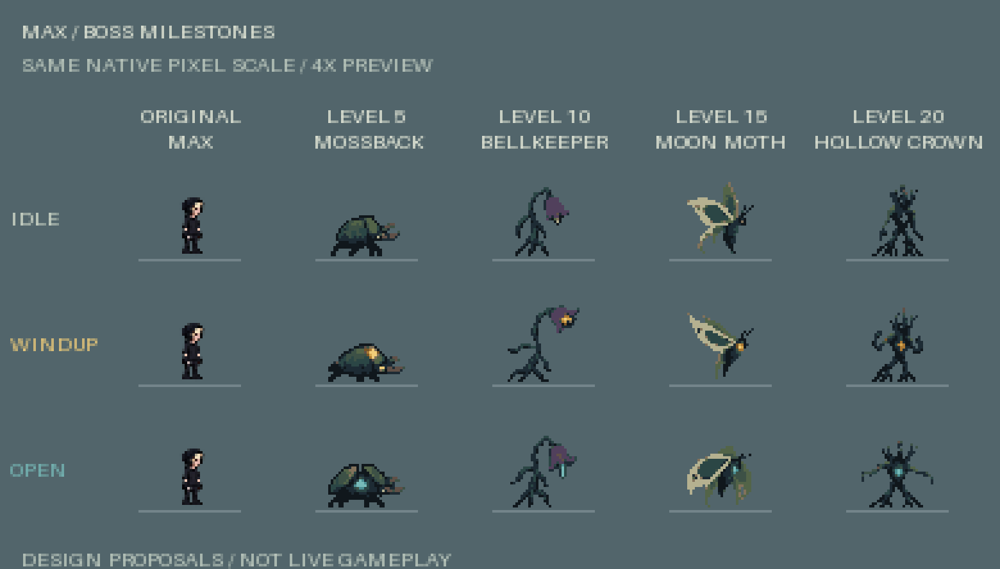

# MAX — native boss sprites ready for integration

**Four packed native sheets, four atlas manifests and 256 isolated PNG frames**
for **max.iverfinne.no**, covering boss designs for levels 5, 10, 15 and 20.
Every isolated frame matches its packed sheet cell exactly. Delivery checks
passed for geometry, binary alpha, declared palettes, fixed anchors, state
packing, colour signals and transparent final death frames. See the detailed
[validation report](validation.json).

The pixel assets are ready for developer integration. Their appearances and
8 fps animation timings are proposals; this pack does not wire them into live
encounters, change attacks or collisions, or replace the current Crown phases.

| Level | ID | Sheet / atlas | Design |
| --- | --- | --- | --- |
| 5 | `mossback` | [PNG](native/05-mossback.png) · [JSON](native/05-mossback.json) | Low, broad beetle; moss armour; planted anticipation followed by a charge. |
| 10 | `bellkeeper` | [PNG](native/10-bellkeeper.png) · [JSON](native/10-bellkeeper.json) | Tall, bent bellflower; three root legs; bell contraction and spore-ring release. |
| 15 | `moon-moth` | [PNG](native/15-moon-moth.png) · [JSON](native/15-moon-moth.json) | Broad pale moth; small dark central body; distinct open and folded wing silhouettes. |
| 20 | `hollow-crown` | [PNG](native/20-hollow-crown.png) · [JSON](native/20-hollow-crown.json) | Root crown variant with a hollow opening through its chest. |

[Pack manifest](manifest.json) indexes the four compatible
`max-native-atlas/v1` manifests. Each frame also links to its individual PNG in
`frames/<id>/<state>-<00..07>.png`, for example
[Mossback idle frame 0](frames/mossback/idle-00.png). These are full transparent
32×32 cells, with the same pixels and anchor as the packed sheet.



## Preview

Open [viewer-standalone.html](viewer-standalone.html). Its four PNG sheets are embedded,
so it needs no server, network connection or neighbouring files. Choose a state,
play or pause, scrub its eight frames, change the preview speed, or switch the
background. Every boss is displayed at the same integer **4× or 6×** scale.
The optional full-sheet view uses an exact **2×** enlargement and scrolls on
small screens. Downloads preserve the native PNG bytes.

[viewer.html](viewer.html) uses relative `native/` paths. The standalone version
embeds the same PNG bytes unchanged. The user ZIP includes `embed-viewer.mjs`
to regenerate it with `node embed-viewer.mjs`; the repository handoff needs only
the ready viewer files.

The `preview/` folder also contains exact 4× full-sheet PNGs and complete
64-frame GIF sequences at 6× scale. Each GIF lasts eight seconds; alternating
120/130 ms frame durations represent 8 fps within GIF's centisecond timing.
The scale contact uses boss frames 0, 21 and 44 for idle, windup and vulnerable.
Original Max's idle frame is repeated as a size reference in each row.

## Frame contract

The verified sheet geometry is **256×256 pixels**: eight columns × eight rows,
with **32×32 native pixels per cell**. Each character has 64 frames. For
zero-based column `c` and row `r`, the source rectangle is:

```text
x = c × 32; y = r × 32; width = 32; height = 32
frame index = r × 8 + c
```

Each row is eight successive poses of the **same character**, read left to
right. Every frame shares the **(16,31)** registration anchor and faces right.

| Row | Frame indices | State | Gameplay playback intention |
| --- | --- | --- | --- |
| 0 | 0–7 | `idle` | Loop. |
| 1 | 8–15 | `move` | Loop. |
| 2 | 16–23 | `windup` | One-shot driven by actual attack anticipation progress. |
| 3 | 24–31 | `attack` | One-shot; damage remains controlled by gameplay. |
| 4 | 32–39 | `recover` | One-shot. |
| 5 | 40–47 | `vulnerable` | Loop for the complete exposure window. |
| 6 | 48–55 | `hurt` | One-shot; use the game's existing damage flash if needed. |
| 7 | 56–63 | `death` | One-shot, clamped; intended last frame is transparent. |

All 32 animation clips declare **8 fps** as a complete integration proposal.
The viewer repeats each selected row for inspection. Actual attack anticipation
and vulnerability must follow gameplay timers. Use the existing renderer's
progress input for windup rather than triggering damage from an image frame.
[frame-contract.json](frame-contract.json) records verified geometry, candidate
mapping, playback intentions and the registration exception below.

Bellkeeper's final two windup cells deliberately repeat frame 21
(`windup-05.png`), holding its strongest amber pose until attack release.
The sheet, isolated PNGs, metadata and provenance agree on this pose hold.

## Pixel and rendering rules

- Draw at 1:1 on the native game canvas; enlarge the canvas by integer scaling
  with image smoothing disabled. Preserve whole pixels.
- Keep the fixed anchor and stable body scale. Do not trim, auto-centre, stretch
  or individually rotate packed frames. Mirror at render time for left facing.
- Use transparent backgrounds and binary alpha. No baked checkerboards, labels,
  shadows, scenery or grid lines belong in runtime PNGs.
- Keep restrained dark teal, moss, bark and pale accents. Amber marks windup;
  cyan marks an exposed weak point.
- Preserve gameplay hitboxes, crown health lights, enemy links, damage flash
  and hazard cues. Enemy world coordinates are body centres; convert to the
  intended foot or hover anchor in the renderer.

The grounded bosses reach native row 31 in every nonempty frame. Moon Moth
keeps the same anchor (16,31), with a one-pixel hover variation: frames
0, 3, 18, 21, 22, 36, 39, 41 and 49 end at row 30; its other nonempty frames end
at row 31. This is an intentional airborne pose difference, not a moving anchor.

The validation report includes per-frame bounds, file hashes, signal-pixel
counts and exact packed/isolated RGBA comparisons. Cyan signal colours occur
in every vulnerable frame and nowhere else. Bright amber signal colours occur
only in the windup row; anticipation may begin before bright amber appears.
All four final death cells are empty. Repeated poses are permitted animation
holds; 64 cells does not mean 64 pixel-unique poses.

## Relationship to the existing game

Levels **5, 10 and 15** are new boss concepts. The implemented final boss is
**Hollow Crown at level 20**. Its previous art contract has **128 frames**:
three phases, each with idle/windup/attack/recover/vulnerable, followed by death.
This new **64-frame Hollow Crown sheet supplies ready native sprites for a
new appearance**, but does not replace that 128-frame, three-phase atlas.
Production integration must preserve or supply all three phases separately.
The existing `assets/enemies-v1/hollow-crown/` pack is untouched.

Keep this handoff under `assets/boss-milestones-v1/`. It contains no runtime
imports or build changes. The developer can select the new milestone designs,
map boss identities to these manifests, and connect state timers without
overwriting existing gameplay or other agents' artwork.

Full generation prompts and frame-level source mappings are recorded in
[prompts.json](prompts.json) and [provenance.json](provenance.json). Original
source masters remain in `source/` inside the separately supplied user ZIP;
those `sourceFile` entries are external archive references. Source masters are
intentionally excluded from the repository asset handoff.

Reference contracts: [native art PR #18](https://github.com/lukketsvane/max.iverfinne.no/pull/18),
[graphics coordination](https://github.com/lukketsvane/max.iverfinne.no/issues/10),
and [run director](https://github.com/lukketsvane/max.iverfinne.no/blob/main/run-director.inc.js).
