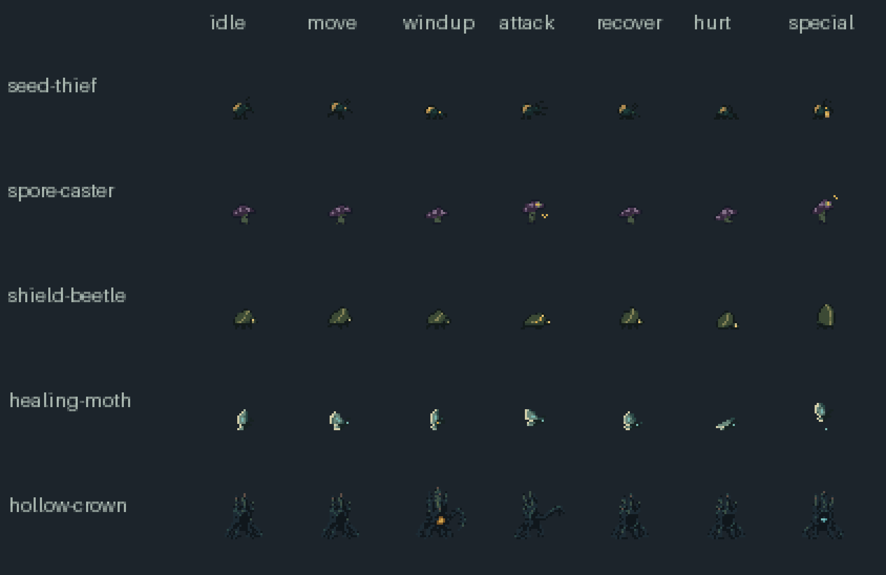
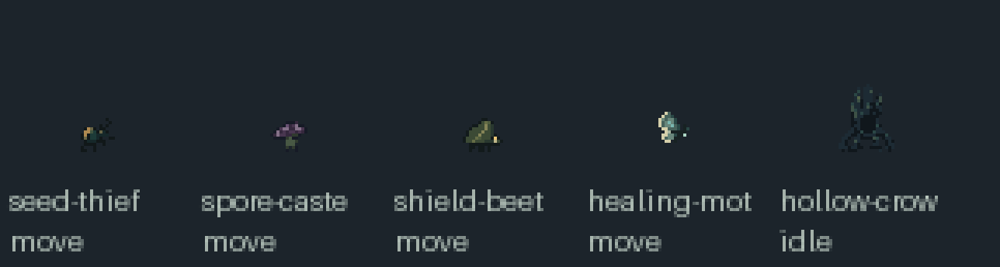
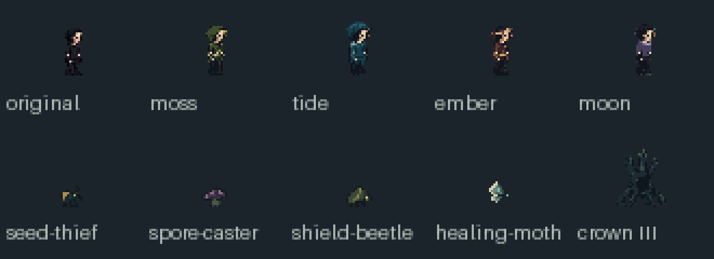

# Enemy roles and Hollow Crown

Native transparent sprites for the roles implemented in `run-director.inc.js`.
This pack is an art handoff, with no changes to collisions, attacks or balance.

| Asset | Game role | Cell / anchor | Additional state |
| --- | --- | --- | --- |
| seed-thief | k.kind === 3 | 16×16 / (8,15) | carry while k.stolen |
| spore-caster | k.kind === 4 | 16×16 / (8,15) | channel |
| shield-beetle | k.kind === 5 | 16×16 / (8,15) | guard; exposed while k.flee > 0 |
| healing-moth | k.kind === 6 | 16×16 / (8,15) | heal while k.healing |
| hollow-crown | k.boss, phase 1–3 | 32×32 / (16,31) | phaseN/vulnerable while k.exposed > 0 |

Each small enemy has a 128×128 sheet: eight frames in each row, ordered
idle / move / windup / attack / recover / hurt / death / special. The beetle's
`exposed` clip reuses recovery frames. Bodies are roughly 7–12px; antennae,
seeds, wings and particles may extend farther. Ground enemies end on the bottom
pixel; the moth's hover offset and wing bob remain part of its pose.

Hollow Crown has a 256×512 sheet. Each phase occupies five rows: idle / windup /
attack / recover / vulnerable. Row 15 is death. Phase hurt is a recovery pose
for the game's existing damage flash. The crown opens and body grows from
roughly 18×22 to 24×28px across phases. Windup has an amber core; vulnerable
has a cyan core. All sheets use binary alpha and fixed palettes (9–14 colours).

`manifest.json` indexes `atlas.json` for each asset. Use `phase1/idle` etc. for
the boss. The last death frame is empty and death is a clamped one-shot.

## Integration contract

Replace the provisional body drawing in `drawRoleEnemy(k,x,y,t)` only after
review. `x,y` in that function is currently a **body centre**, not a foot anchor.
Supply the renderer the corresponding native foot/hover anchor; do not change
enemy positions, physics or hitboxes to align art. Keep crown health lights,
healing links, elite marks, damage flash and gameplay hazard tells as overlays.
Health lights remain on the crown, never in a new screen HUD.

Use state-local elapsed time rather than global time for one-shots; save/reset
the visual state clock independently of authoritative gameplay state. For
windups use `progress = 1 - k.windup / k.tell` in `drawAtlas` from
`../native-atlas.mjs`. This follows actual game timers even if difficulty later
changes them. Default caster windup is .95s; Crown is 1.4s. The spore ground
warning (1.05s) and Crown exposure (1.8s) remain owned by the game. The boss
phase thresholds remain 2/3 and 1/3 health. Resolve death, hurt and tells before
idle/move; no art animation should trigger damage or healing itself.

Previews are exported native PNGs enlarged exactly 4×; the 1× contact sheet is
also included. Boss frames were extracted individually to correct a nonuniform
generated grid; extended roots were fitted to 32px cells. Packing records and
full prompts/master hashes are in `source/`. The source reductions are retained
so `python scripts/build-native-art.py` reproduces final PNG/JSON/GIF files.

`native-art.mjs` now imports these runtime sheets through the production build.
`drawRoleEnemy` preserves primitive fallback art, health lights, healing links,
elite marks and tells. Animation clocks survive co-op snapshots; windups follow
gameplay timers. Death animation is a separate visual effect and never delays
damage, rewards or victory. Use `review.html?mode=native-enemies&portrait=1`
and `review.html?mode=native-crown&portrait=1` for isolated in-game comparisons.
