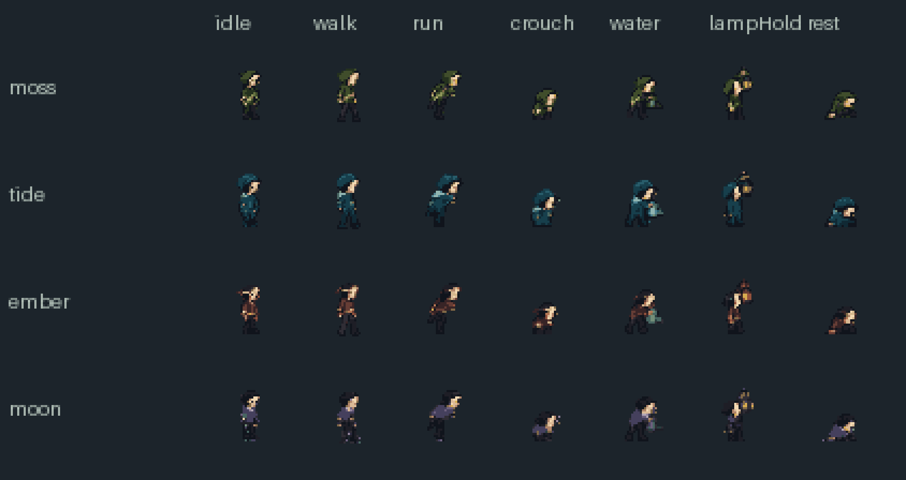
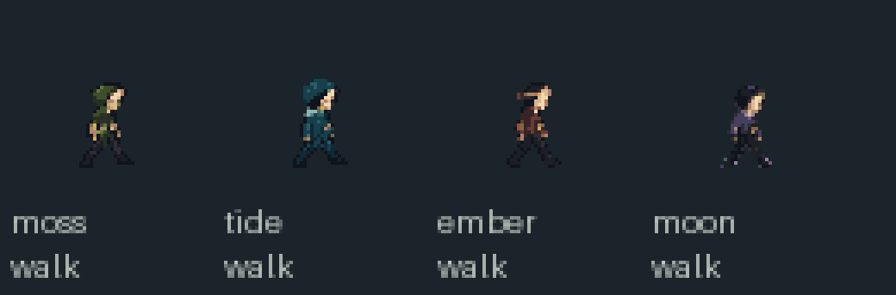

# Four cosmetic Max skins

Moss (pointed hood/satchel), Tide (round rain hood/collar), Ember
(headband/ribbon) and Moon (short cape/cap). Selection is cosmetic and independent
of build paths. Delivered for the main developer's review in issue #10.

| Contract | Value |
| --- | --- |
| Cell / anchor | 32×32 / (16,31) |
| Sheets per skin | main.png + interaction.png, each 256×256 |
| Frames / clips | 128 cells / original 25 named clips |
| Standing silhouette | 10–13px wide, 23–25px tall including accessories |
| Transparency / palette | Binary alpha; at most 16 opaque colours per skin |

`manifest.json` indexes each skin's `atlas.json`. Frame indices 0–63 refer to
main; 64–127 refer to interaction. Rows, frame sequences, fps, looping, `hit`
and `pour` markers match the original ANIM/ANIM2. Event markers are **clip step
indices**, not atlas frame numbers; keep the original gameplay event code.

The existing renderer can use these two images in place of its sheet images
while retaining `ANIM`, `ANIM2`, facing and `dx=px-16, dy=py-31`.
Use the optional `../native-atlas.mjs` for a manifest-driven renderer. Keep
skin choice per player, reset animation elapsed time on state transitions,
and retain original art as a loading/failure fallback.

All frames use integer foot registration against the corresponding original
pose (including jumps, crouches and interaction poses); offsets are recorded
in `registration.json`. No arbitrary per-frame scaling. Hood/cape silhouette
differences are intentional. Original atlas rows 6/main and 5/interaction are
preserved as cells but are not referenced by the original named animations.

`preview/contact-1x.png` is the actual native scale; `contact-4x.png` and GIF
are integer enlargements of the exported PNGs, not generated concept images.
Preview labels are for review only and are not game UI assets.

Generated masters were conditioned on both original Max sheets. Native source
reductions and full prompts/master hashes are in `source/`. Run
`python scripts/build-native-art.py` from the repository root to reproduce the
exports with Pillow and numpy; run `python scripts/verify-native-art.py` to
check frame, palette, alpha and animation contracts. No generator is needed
for game builds. `native-art.mjs` now loads these sheets for the selected
cosmetic skin in solo and co-op play, with original Max as a loading/failure
fallback. The production build copies runtime PNGs and JSON. Use
`review.html?mode=native-skins&portrait=1` to compare all five Max appearances
in the actual game renderer at their native foot registration.
