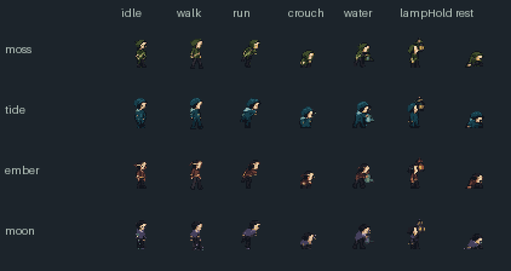
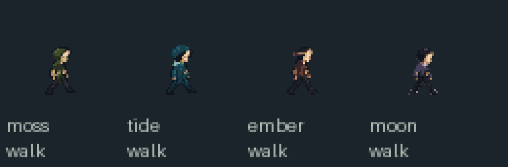

# Native player packs and compatibility artwork

Pølge is an additional playable pack using the same cell, anchor, palette limit
and clip/event contract. Its supplied poses and source provenance are
documented in `docs/asset-review/polge-v1/README.md`.

Tide is Mech's runtime art. Pølge and Sligo have their own packs here. Rattus, Cairn and Mycel use `assets/characters-v2/`. The earlier Moss, Ember and Moon sheets remain source references; appearance is fixed by the selected character.

| Contract | Value |
| --- | --- |
| Cell / anchor | 32×32 / (16,31) |
| Sheets per skin | main.png + interaction.png, each 256×256 |
| Frames / clips | 128 cells / original 25 named clips |
| Standing silhouette | 10–13px wide, 23–25px tall including accessories |
| Transparency / palette | Binary alpha; at most 16 opaque colours per skin |

`manifest.json` indexes each skin's `atlas.json`. Frame indices 0–63 refer to
main; 64–127 refer to interaction. Rows, frame sequences, fps, looping, `hit`
and `pour` markers match the original ANIM/ANIM2. Event markers are **clip step
indices**, not atlas frame numbers; keep the original gameplay event code.

The existing renderer can use these two images in place of its sheet images
while retaining `ANIM`, `ANIM2`, facing and `dx=px-16, dy=py-31`.
Use the optional `../native-atlas.mjs` for a manifest-driven renderer. Keep
skin choice per player, reset animation elapsed time on state transitions,
and retain original art as a loading/failure fallback.

All frames use integer foot registration against the corresponding original
pose (including jumps, crouches and interaction poses); offsets are recorded
in `registration.json`. No arbitrary per-frame scaling. Hood/cape silhouette
differences are intentional. Original atlas rows 6/main and 5/interaction are
preserved as cells but are not referenced by the original named animations.

`preview/contact-1x.png` is the actual native scale; `contact-4x.png` and GIF
are integer enlargements of the exported PNGs, not generated concept images.
Preview labels are for review only and are not game UI assets.

## Current authoring and integration

Native runtime sheets are edited in [Figma frame 160:2](https://www.figma.com/design/TC0PHGMTCMR6im4hb3CSbF?node-id=160-2); follow [docs/figma.md](../../docs/figma.md). Original reductions, prompts, master hashes and registration data remain as provenance. The import/packing generator was retired after integration.

Appearance belongs to the character. The build ships Tide for Mech, Pølge's own sheets and Sligo's sheets. Rattus, Cairn and Mycel use `assets/characters-v2/`; the older Moss, Ember and Moon sheets are historical references. `native-art.mjs` retains original Max as a loading/failure fallback.

## Sligo, the easter egg

`sligo/` is a fifth pack under the same contract: Max Sligo Neverdahl, a pink
one-eyed tardigrade. Its original source sheet is in `docs/asset-review/sligo-v1/`, whose README gives the row use,
the interaction poses and the review. It is integrated as the hidden Sligo character. Sligo stands 24px tall and 13–15px wide. Where the original body bottom is
a cell's last row (walk, stretch, run 2 and 5), its feet stand one pixel higher
so no cell touches its edge.
