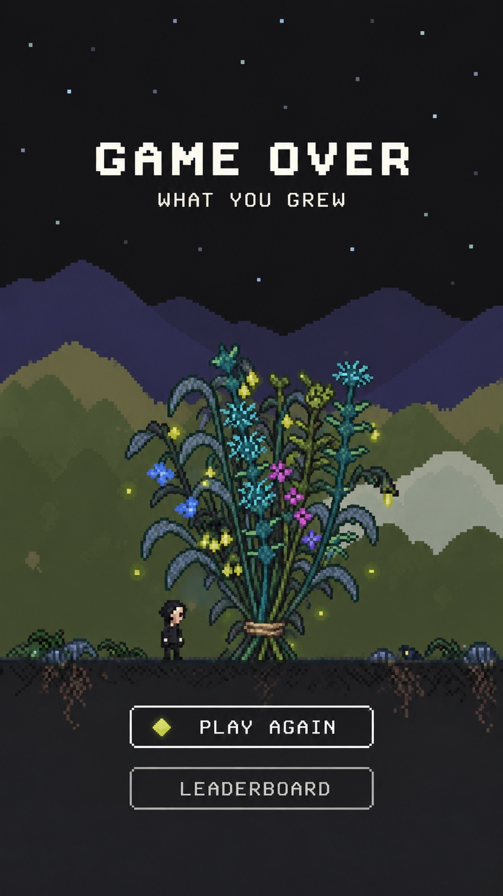

# Approved game-over screen and run-based bouquets

The user's latest direction is: **“THIS IS WHAT WE WANT AND WE WANT IT TO ACTUALLY REPRESENT THE PLAYERS RUN.”**

The user asked for this requirement to be handed to the main developer agent. Continue the implementation on current main; the native bouquet work in commit `69ffc97df7affb9669c7b6ec6d22113be808cc22` is already present.

## Visual target

Use the attached reference as the target: portrait composition, night sky and original landscape, **GAME OVER / WHAT YOU GREW**, a tall, fanned bouquet with visible stems gathered in a tie, Max beside it, and **PLAY AGAIN / LEADERBOARD** beneath. All UI text is English. Preserve the game's native pixel grid and relative sprite sizes. The reference is design guidance, not a high-resolution texture to paste into the game.

## The bouquet must be the player's actual run

- Build it from that round's saved plant records. Preserve each plant's identity, species/kind, seed-dependent appearance, attained growth and beanstalk state.
- Include plants from the whole round, including previous worlds and the maximum growth already retained by the game.
- Render those records with the actual game atlas and plant renderer. Do not substitute the sample bouquet sheets, generic small/medium/large tiers, random flowers or a decorative fixed bouquet.
- Save the complete plant records with each leaderboard entry. Render every entry from its own saved run, including after reload and after the current player starts another round.
- Keep every plant. If the complete run needs more space or additional bundles, make all of them accessible; do not silently truncate it.
- Present the highscore through the bouquet, without a displayed points total.

The requested **example leaderboard order** is **IVER first, RUNKEMANNEN second, IDA third**, with IVER highlighted as YOU. These are the requested design-preview names, not fabricated live scores.

## Acceptance check

Compare two runs with different plant species and growth. Their bouquets must visibly differ for those reasons. Confirm that a saved leaderboard bouquet remains identical after reload/retry, and that every original plant ID is represented across the complete result.

This handoff adds the user's reference and requirements only. It does not replace the main developer's runtime, account, save or database work.
