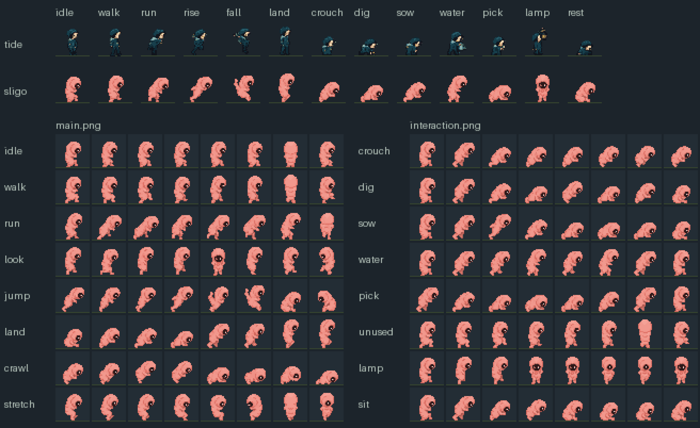
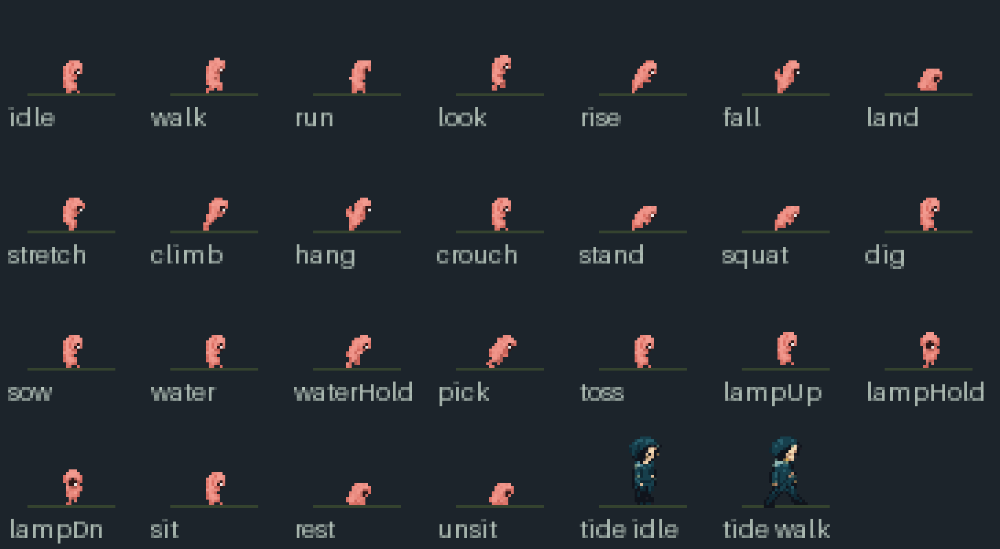

# Max Sligo Neverdahl — the easter-egg skin

The owner asked for a fifth character, an easter egg called **Max Sligo Neverdahl** (Sligo for short, pack id `sligo`), and sent its sprite sheet to build it from. This folder keeps that sheet and the review of what was built from it.

## The owner's sheet

`source.png` is the sheet as sent: 1254×1254 RGBA, an 8×8 grid of 156.75 px cells. Each cell holds a pink, tardigrade-like creature with one big dark eye, facing right. Its rows follow Max's main sheet:

| Row | Poses |
| --- | --- |
| 0 | idle; it glances round (5 and 7 face left, 6 is a back view) |
| 1 | walk; 6 is a back view, 7 faces left |
| 2 | run; 7 is a back view |
| 3 | look; 4 is a front view, 7 faces left |
| 4 | jump: rising 0–3, arms up 4–5, landing tucks 6–7 |
| 5 | land and crouch: curled 0, crouched 1–3, rising 4–5, upright 6–7 |
| 6 | the spare row: crawling poses |
| 7 | stretch; 5 faces left, 6 is a back view, 7 a front view |

The sheet came out of an image generator with its background removed. A red and yellow halo and speckle fill the transparent pixels round every frame. They lie below 1/8 alpha or apart from the body.

## Build

`python3 scripts/build-sligo.py` (Pillow, numpy, scipy, no randomness) writes:

- `assets/max-skins-v1/sligo/`: `main.png`, `interaction.png` and `atlas.json`;
- this folder: `contact-1x.png`, `contact-4x.png`, `animations-4x.gif` and `registration.json`.

`--export DIR` also writes copies for the owner: both sheets at 1x, and the same padded to 36×36 cells (feet at 18,33).

The build works in these steps:

- **Frames.** It finds the 64 creatures by their opaque cores. The grid is not whole pixels, so each core goes to the cell its centre is in.
- **Cleaning.** A creature is its core, plus the pixels of at least 1/8 alpha joined to it, less halo colours (bright red or yellow with almost no blue). Enclosed holes are filled from the nearest body colour. None of the halo is kept.
- **Scale.** One scale for the whole sheet: 1/4, so the standing creature is 24 px tall, like the other skins (tide stands 25). It is wider than Max: 13–15 px. It uses a premultiplied box filter with hard alpha at half.
- **Drawing.** Some features would blur at 1/4, so they keep their own colours:
  - a pixel on the silhouette takes the colour of the source's outline band;
  - a pixel that is at least 30% crease takes the creases' colour;
  - a pixel that is at least half eye takes the eye's dark;
  - the eye's highlight becomes the one pixel it covers most.
- **Palette.** One palette for both sheets, 16 colours: median cut (no dither) to 14 over the distinct body colours, plus the eye's dark and the highlight.
- **Registration.** As the other skins:
  - each frame is centred on x=16;
  - its lowest row stands on the original Max frame's body bottom (`assets/max-skins-v1/source/original-poses.json`), so feet stand on the soil and jump frames keep their lift.

  In 18 cells that bottom is the cell's last row: the whole walk row, run 2 and 5, and the whole stretch row. There Sligo stands one pixel higher, so no cell is touched at its edge. `scripts/verify-native-art.py` compares feet exactly, so it reports these 18 cells. A frame that would overflow its cell stops the build: the fix is a smaller scale for every frame, never a crop.

`registration.json` records the scale, the palette, each creature's box in `source.png`, and the pose, mirror, feet and size of every cell.

## main.png

This is the owner's sheet row for row. Two things change:

- **Left-facing profiles.** The three that play in loops while the player stands or walks (idle 5 and 7, walk 7) are mirrored, so Sligo faces the way the player faces.
- **Kept as drawn.** The back views (idle 6, walk 6) stay: they show for one frame per loop. The fidgets keep their turns: look ends facing left, and stretch turns about.

## interaction.png

The owner's sheet has none of Max's interaction poses, so every interaction cell reuses a main-sheet pose. Each clip keeps its frame count and markers. The poses are given as (row, column) of `main.png`:

| Row | Clips | Poses |
| --- | --- | --- |
| 0 | crouch 0–3 (stand plays it back), squat 4–7 | idle (0,0), (5,4), (5,2), (5,1); then (5,1), (6,0), (6,1), (6,0): the landing row backwards, then a low alert crouch |
| 1 | dig, hit on 3 | (0,0), (5,4), (5,2), nose to the soil (5,3) on the hit, (6,3), (5,3), (5,1), curled (5,0) |
| 2 | sow, hit on 6; toss 0,1,2,2,1, throws on 2 | (0,0), (5,4), the lunge (4,3), (5,2), (5,3), (6,4), (5,3) on the hit, (5,0) |
| 3 | water, pour 2–7; waterHold loops 2–5 | (0,0), (5,4), then leaning over the plant (5,5), (2,6), (5,5), (2,6), (5,4), (0,0) |
| 4 | pick, hit on 3 | (5,4), (5,2), (5,3), lying (6,4) on the hit, (5,3), (5,1), (5,4), (0,0) |
| 5 | none: Max carries a crate here | the walk, as on `main.png` |
| 6 | lampUp 0–3 (lampDn plays it back), lampHold 4–7 | (0,0), (3,2), (3,3), the front view (3,4); then (3,4), (7,7), (7,7), (3,4). Sligo turns to face out; the game draws the lantern's glow on its face |
| 7 | sit 0–5 (unsit plays it back), rest 6–7 | (0,0), (5,4), (5,1), (6,0), (4,6), (5,0); then (5,0), (4,6). A tardigrade rests curled up as a tun. The curl leaves the place where the game sets the lantern clear |

## Not in the game yet

This is the art pack only:

- `assets/max-skins-v1/manifest.json` still lists the four skins.
- `native-art.mjs` (`SKINS`), `max-classes.js` (`skin()`) and `scripts/build-static.cjs` know only those four.
- `tests/sligo-pack.test.cjs` checks the pack's contract.
- **Figma.** `main.png` is pinned in `assets/figma-pending.json`, because the menu's `assets/max-skins-v1/<id>/main.png` counts it as loaded. `interaction.png` joins that list when the game loads the pack.
