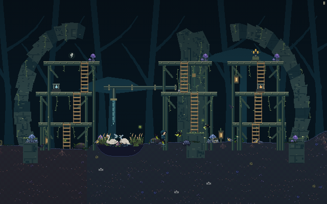
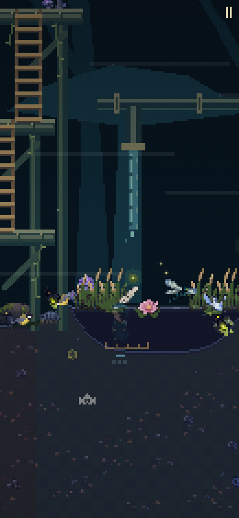

# Authored pond — normal compiler and runtime review

This separate review package tests a pond through the ordinary level compiler
and runtime. Its editable XML is **synthetic offline input**, not an authenticated
Figma capture. The local `designed` marker selects an isolated Garden 2 candidate;
the repository's live `levels-data.js` is not replaced.

The source adds one `pond:20` instance to the unchanged Broken Waterworks dry
geometry. Its native rectangle is `(183,205,94,24)` in the original source frame:
center x −85, rise −2, half-width 47, bank width 20 and depth 24. With the
original soil at y=1, the native water surface is y=3 and its central bed is y=27.
The wet span is x −132…−38; the depressed banks end at x −152 and −18. The x=0
court and central pier approach remain dry.

The normal `scripts/figma-levels.mjs --from … --out …` CLI creates
`garden.ponds`. The ordinary `MaxLevels.build` creates `L.ponds`, which the built
runtime consumes for native terrain, pond rendering and player water behavior.
The new observer metadata references **that exact `L.ponds[0]` object**. It
does not create a second pond, replace a native pond cache entry, or override
`pondInBucket`, `surfaceY`, `waterAt` or `updatePlayer`.

The existing Waterworks scenery and presentation fixture are used unchanged.
They draw original native vectors and registered Sanctuary crops and skip only
the duplicate generic platform artwork. Actual colliders and ladders are retained.
Historical dry/fixture-based wet evidence remains frozen in its original folder
and is not used as proof for this compiler path.

## Reproduce

The receipt wrapper invokes the normal CLI with the arguments shown below and
checks that its source files and production level data stay unchanged. Compile
into this package's isolated output, then build the current runtime:

```sh
node docs/design/authored-ponds/source/compile.cjs
npm run build
```

Its normal CLI command is
`node scripts/figma-levels.mjs --from docs/design/authored-ponds/source/synthetic-pond-source.json --out docs/design/authored-ponds/bundle/candidate-levels-data.js`.

The bound compilation receipt records the exact command, source hashes, compiler
output and unchanged production level-data hash. The portable browser runner
requires that receipt to match its candidate and current source files. It uses
an existing Playwright installation and Chromium, and requires a fresh output
directory outside the repository:

```sh
PLAYWRIGHT_MODULE=/absolute/path/to/playwright \
node docs/design/authored-ponds/evidence/capture.cjs \
  --out /tmp/max-authored-pond-new-capture --story yes
```

The runner serves the built files read-only and injects the isolated candidate,
unchanged historical presentation files and metadata observer only into local
responses. No external requests or multiplayer connections are permitted.
Exact built native function bodies are compared with the observed live bodies.
Polling budgets allow a slow headless renderer without advancing the game clock
or changing player physics. The story retains every sampled frame.

Its phone and desktop stories use ordinary keyboard controls after one supported
dry-soil initialization. Each story enters the native pond, jumps/swims back onto
the dry court, jumps onto the central pier, climbs both central galleries,
descends both ladders, returns to dry soil and uses Tend. A native interruption
can be followed by a released/repeated Space press after ordinary recovery;
each attempt is recorded. Source functions and
poses are not repaired after controls begin. Fixed-camera screenshots execute
the actual built drawing body and restore all observed mutable state, DOM and
the live canvas synchronously.

## Actual browser evidence

Compilation, the build and both continuous gameplay stories passed. The final
capture uses the candidate SHA
`87b76780c93b0170038a2f1e4c2a4096fee6ef26593fa2aaf5193fef08872131`.

| Viewport | Native wet feet y | Retained frames | Dry return → Tend |
| --- | ---: | ---: | --- |
| Phone 390×844 | 26.2093 | 1,095 | One real plot; seeds 9→8 |
| Desktop 1000×650 | 26.9999 | 991 | One real plot; seeds 9→8 |

Both runs use ordinary controls from a supported native dry-soil initialization.
They cross the compiled pond, jump/swim onto the dry court, jump onto the actual
sluice pier, climb both galleries, descend both ladders and return to dry soil.
Both final runs planted on their first Space press. Desktop received a normal
knockback just after its successful sow; its observed airborne pose is preserved.
Native water, terrain and player function bodies and identities stayed unchanged;
lookup and physics adapter counts are **zero**. There were no browser errors,
failed requests or multiplayer connections. Built and prototype bytes stayed
unchanged throughout capture.





The fixed native 640×400 and 640×440 images run the actual built drawing body
without bitmap resizing. Their checks restore 405 observed mutable bindings,
reachable gameplay state, DOM and the live canvas synchronously, with no detected
changes. This restoration covers the observer's recorded state and does not claim
independent module caches are exhaustively observed.

- [Synthetic editable source](source/synthetic-pond-source.json),
  [XML](source/synthetic-pond-source.xml), [compiler output](bundle/compiler-report.txt)
  and [compilation receipt](bundle/compilation-receipt.json).
- [Exact normally compiled candidate](bundle/candidate-levels-data.js),
  [snapshot metadata](evidence/snapshot-metadata.json) and
  [capture/source/image manifest](evidence/capture-manifest.json).
- [Portable browser report](evidence/browser-review.json),
  [unchanged raw report](evidence/browser-review.raw.json),
  [full chamber](evidence/garden-02-full-chamber-native.png),
  [desktop](evidence/garden-02-desktop.png) and
  [phone high gallery](evidence/garden-02-phone-high-gallery.png).

[Diagnostic receipts](evidence/attempts.json) retain two earlier fresh-run
failures: a short wall-clock wait under slow rendering and a native knockback
that interrupted desktop sow while Space remained held. Only the new observer's
waiting/input sequence changed between attempts; compiler, runtime, art and pond
source remained frozen. These diagnostics are separate from the passed report.

Publish a successful fresh capture with
`node docs/design/authored-ponds/source/publish-evidence.cjs /absolute/raw-capture-directory`.
The publisher rechecks current source/candidate/receipt/metadata/production-data
hashes and every recorded PNG before byte-for-byte copying. Its portable report
only maps raw artifact paths; the complete original report remains unchanged.

This evidence covers the recorded Mech routes in these two viewports. It does
not claim authenticated Figma synchronization, production activation, new PNG
masters, moving water mechanisms or final production gameplay approval.
