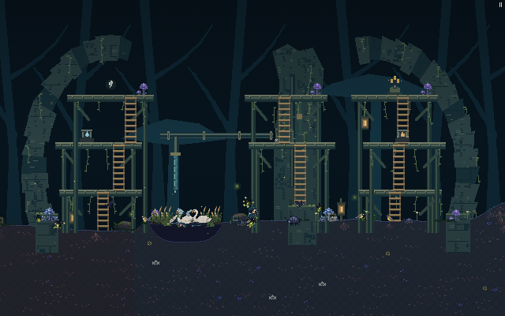

# Broken Waterworks — working early garden study

This is a native geometry draft for Garden 2, based on the owner's October 10
waterworks reference and later mechanism, water, moss and vegetation sheets.
It is separate from the Garden 1 Tree Hollow checkpoint. The proposed ordering
of later rooms below is a composition recommendation, not an approved campaign.

The original native scene now has two broken curved masonry abutments, a central
sluice pier, open arch apertures, timber galleries, moss and amber lamps. Its
recessed pipe leak is scenery; it does not operate a water mechanism. The dry
room has actual phone and desktop movement and planting evidence. An optional
native pond study is separate from that dry proof.



[Phone gallery](evidence/garden-02-phone-high-gallery.png) ·
[Desktop planting](evidence/garden-02-desktop-planted.png) ·
[Exact browser evidence](evidence/browser-review.json)

Both browser stories use ordinary input after one supported original-soil
initialization: jump onto the real central footing, climb two ladders, descend,
return to original dry soil and Tend. Both spend exactly one seed (8 to 7) and
create an actual plot. The world keeps running. No actor placement, collision
repair or player-physics patch occurs after the story starts.

## Source and scope

- [geometry.json](geometry.json) is the integer authored source. Garden 2's
  origin is 207510 and its original soil line is 1 native pixel.
- [bundle/import.use-figma.js](bundle/import.use-figma.js) and
  [bundle/code.js](bundle/code.js) create editable `review-garden-02b` geometry.
  The import contains no `designed` marker and does not activate a runtime frame.
- The isolated [bundle/candidate-levels-data.js](bundle/candidate-levels-data.js)
  adds activation only in a synthetic compiler fixture for actual-engine tests.
  Its compiler report's `live` label refers to that local fixture, not Figma or
  production. The source explicitly uses `live: false` and `replacePicture: true`.
- Existing `levels-data.js`, runtime art and source PNG masters are unchanged.
  The attached sheets are visual references; no new registered masters or fresh
  Figma synchronization are asserted.
- [waterworks-scene.js](waterworks-scene.js) draws original integer shapes and
  unchanged native Sanctuary crops, selecting only the offline `garden-02b`.
- [preview-fixture.js](preview-fixture.js) installs the finite seed-1 presentation
  adapter. It retains all actual colliders, native soil, water and player physics.
- [import-scene.use-figma.js](import-scene.use-figma.js) is an unexecuted editable
  scenery import, regenerated by [export-scene-review.cjs](export-scene-review.cjs).
  It binds the candidate, scene and dry fixture bytes and checks the actual native
  Figma master before creating shapes. It contains no `designed` marker.

Eight timber ledges, three substantial solid stone footings and eight authored
ladders form three independent dry climbs. All eleven collider tops are graph-C0.
The required reward, seed reserve and two trial markers have supported C0 footing.
Ladder junctions deliberately stagger sideways: coincident upper/lower ladders at
the same x can prevent ordinary upward attachment in the current engine.

[evidence/dry-route-physics.json](evidence/dry-route-physics.json) records a completed
12/12 actual-physics sweep: all 11 collider tops and 10 markers per case, 96 ladder
round trips, 24 reward/seed returns and zero failures. Two independently loaded
clients agree for seeds 1, 2026 and 4294967295. The tested candidate SHA-256 is
`b6e8e87d7523ecbf63469bd7c44b814a86dd845dec8d0004fc5a264a5e1c7eff`.

## Reproduce the bounded review

```sh
node scripts/figma-authored-drafts.mjs \
  --from docs/design/early-gardens-waterworks/geometry.json \
  --out docs/design/early-gardens-waterworks/bundle
node docs/design/early-gardens-waterworks/verify-dry-routes.cjs \
  docs/design/early-gardens-waterworks/bundle/candidate-levels-data.js \
  /tmp/max-waterworks-dry-physics.json --stages 2
```

The verifier uses the actual game `stageLayout`, `updatePlayer`, jump input and
ladder input for all four base classes at 30, 60 and 120 Hz. Each independent
route begins once on a supported dry soil entry that passes the actual solid
overlap check; it never positions the actor
between successful hops. Same-takeoff retries and alternative return searches
are disclosed in the report. It checks all collider tops, markers, ladders in
both directions, physical reward/seed returns and two independent clients at
three seeds. It does not assert an aerial crossing over the intended open gaps,
and rejects automatic furnishing as return support. This is physics evidence,
not an actual in-game artwork screenshot.

Every grounded tick of the ordinary reverse return checks the actual platform
identity against the authored collider set; original bare soil is allowed. The
alternative return search and replay apply the same restriction. The completed
report includes this policy and passed all 24 returns without using an
alternative search.

If the compiler's jump heuristic chooses soil inside a solid footing, this
observer selects a legal outside-soil entry before that independent route starts
and records both entries. The first hop must then succeed with ordinary physics;
the verifier never repairs a buried ladder approach. The three low footings have
real C0 jump approaches, rather than ladders ending underneath solid blocks.

## Separate native pond study

[basin-preview-fixture.js](basin-preview-fixture.js) optionally overlays one real
native pond after the dry candidate is compiled. Its center is x −85, half-width
47, bank width 20, depth 24 and surface two pixels below original soil. The wet
span is x −132…−38 and the depressed banks end at −152 and −18. Both low ladders,
the central pier approach and the x=0 court stay dry.

The overlay uses the existing pond renderer, terrain depression and water physics.
It creates no collider, rewrites no player or terrain function body and never
overwrites a native pond-cache entry. It is scoped to this seed-1 review frame.

[basin-physics.json](evidence/basin-physics.json) records 12/12 actual physics cases:
four base classes at 30/60/120 Hz cross from the court through the water to the
left dry bank, then return through water to the court. All 24 crossings enter
native water; feet reach approximately y=27 on the depressed bed. There are zero
failures, furnished return supports or actor relocations after input starts.
This bounded proof does not claim every upper marker or a moving water mechanism.

[Actual phone pond](evidence/basin/garden-02-phone-native-basin.png) ·
[Dry-bank exit](evidence/basin/garden-02-phone-dry-bank.png) ·
[Gallery climb](evidence/basin/garden-02-phone-high-gallery.png) ·
[Returned planting](evidence/basin/garden-02-phone-planted.png) ·
[Exact wet browser evidence](evidence/basin/browser-review.json)

Both wet browser stories cross the real pond, leave it with ordinary upward
input, climb and descend the central galleries, then walk to genuine dry soil
at x+111 and Tend. Each creates one healthy plot and spends exactly one seed
(9 to 8, after actual route loot). Their clocks advance normally and their actor
poses, health and collisions are not repaired. The dry report and capture runner
remain frozen separately; the wet runner is [capture-basin.cjs](evidence/capture-basin.cjs).

Reproduce it independently, writing to a fresh path outside the repository:

```sh
node docs/design/early-gardens-waterworks/verify-basin-physics.cjs \
  /tmp/max-waterworks-basin-physics.json
```

The portable browser runners require an existing production build, Playwright
installation and Chromium. `PLAYWRIGHT_MODULE` selects that installation and
`CHROMIUM_PATH` selects Chromium. They create fresh outputs outside the repository
and serve source/build files read-only. Run either with `--help` for exact options:

```sh
node docs/design/early-gardens-waterworks/evidence/capture.cjs --help
node docs/design/early-gardens-waterworks/evidence/capture-basin.cjs --help
node docs/design/early-gardens-waterworks/export-scene-review.cjs
```

The editable scenery import above contains original shapes and native crops only.
It does not export the separate pond, actual actors, soil or ladder rendering.
It has not been run against Figma. Authentication and explicit authored water
integration remain necessary before this room can enter production.

## Production water and mechanism contract still needed

The original Garden 2 terrain has no native pond within x −320…+320. The dry
candidate retains that original terrain. The optional fixture above is a
separately tested finite native pond, rather than an authenticated source export.
A larger flooded room needs an authored basin extent, surface, bed, dry banks and
supported court. The central pier will need a genuine dry bridge or another
supported approach if the basin covers it. The dry C0 result must not be reused
as proof for a flooded variant.

The compiler supports static blocks, one-way ledges, markers and ladders. It does
not encode a sluice state, falling-water force, moving pulley platform, swinging
pod, acorn mass, seesaw rotation or moving beetle. Any such behavior needs a
separate bounded simulation, co-op authority/guest contract and actual traversal
review. Waterfall ornament alone may be scenery, but must not claim to operate a
sluice or move a player. No below-soil cave is created by this draft.

## Proposed next compositions

| Draft room | Reference focus | First credible playable pass |
| --- | --- | --- |
| Garden 2: Broken Waterworks | Circular mossy ruin, pipe fall and central sluice | This original scene, dry galleries and separately defined native pond; source integration remains pending |
| Acorn Crossing | Fallen logs, amber lanterns and an acorn seesaw over a root ravine | Fixed supported timber crossing and climbable side route; moving weight/rotation requires new mechanics |
| Hanging Seed Pods | Three hollow pods, pulleys, ropes and deep teal mushrooms | Static pod landings with real ladders and independent returns; swinging and counterweights remain separate work |
| Beetle Causeway | Huge beetle spanning reflective water, roots at both banks | An original static body with explicit collision and dry planting banks; walking beetle motion requires new mechanics |
| Flooded Roots | Tunnels, broken stone arches and connected pipe falls | Defined shallow native pools and supported platforms, with visible safe entrances and physical returns |

Garden 1 remains the hollow-tree entrance requested by the owner. These later
room names and their order should be evaluated through frequent actual game
screenshots once their art and finite fixtures exist.
