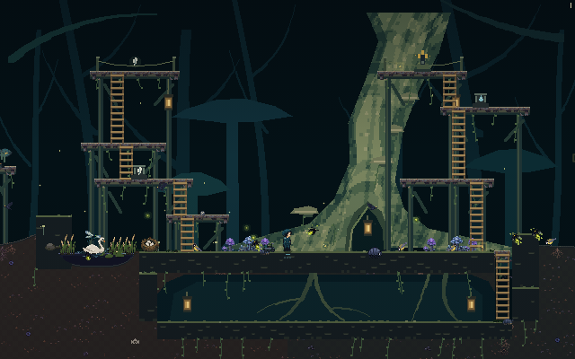

# Tree Hollow Entrance — Garden 1 reference prototype

This prototype implements the owner's October 10 hollow-tree entrance reference:
a giant leaning tree with a lit root hollow, broad timber terraces, supported
ladders, restrained olive moss, a left pond with the existing swans, and a dark
passage beneath the soil. It replaces the rejected frozen-vault visual direction
for this Garden 1 study.

**Offline review only.** The Figma connectors require reauthentication. Neither
this folder nor its screenshots establish a fresh Figma export, a live authored
level or a production release. Production `levels-data.js`, the existing picture
masters and all 665 registered production PNGs remain unchanged.

## Actual-game review



The image above uses the actual built game's drawing body at a fixed native
640 × 400 camera. [Full chamber, 640 × 440](evidence/garden-01-full-chamber-native.png)
shows the extra lower margin. The normal
[desktop view](evidence/garden-01-desktop.png) and
[phone view](evidence/garden-01-phone.png) preserve their live viewport cameras;
none of these PNGs is resized.

Both desktop and phone completed the same seed-1 Max story using ordinary
keyboard input: walk from the court to the entrance, descend the ladder, hold
against both passage walls, return up the ladder to the dry court, then use
Tend to plant. The walls stop the player at x = 246 and x = −141. Each final
plant creates one plot and spends exactly one seed, from 11 to 10 after ordinary
route pickups. No actor is relocated after input starts. The complete
[browser report](evidence/browser-review.json) retains the input history and
checkpoint states. Final planted-court views are available for
[desktop](evidence/garden-01-desktop-story-passed.png) and
[phone](evidence/garden-01-phone-story-passed.png).

This lower-room proof covers that single class and seed in both viewport sizes.
The separate upper-route proof covers four classes at three frame rates.
The capture server serves the existing build read-only and injects the
candidate, scene, fixture and observer only into local responses with isolated
storage. The fixed-camera captures restore 405 mutable closure bindings and
1,905/1,906 reachable objects; the report confirms unchanged gameplay objects,
DOM and live canvas. Both viewport runs report no page/console errors, failed
requests or WebSocket connections, ready native assets and disabled smoothing.

The [capture manifest](evidence/capture-manifest.json) binds all copied image and
report bytes. Its source pins match these frozen files:

| Source | SHA-256 |
| --- | --- |
| Upper candidate | `de1594352f8e10d20f051932639a6efdc6bf121c40ea778dfb09b31426bbfb6e` |
| Native scene | `ec9e46730e0850a35553c24061deaf0aa67f7528ec5c5aed70f5b63da3eb5ab1` |
| Preview fixture | `abec3a0cf52a3274548d926dda1f7c956d90bd51ad67c150925deaabd53fc815` |

See [capture reproduction and limits](evidence/README.md). These screenshots
verify the local prototype and its explicit supplements; they do not establish
an authenticated Figma import or production activation.

## Native registration and files

The intended composition is 640 × 400 native pixels. At seed 1, Garden 1's origin
is x = 0 and the original integer soil base is y = 8. The scene bounds are
`{x: -320, y: -272, w: 640, h: 400}`. Draw at integer coordinates, one source
pixel per game pixel, with smoothing disabled. A full screenshot may display
those native pixels at the game's normal integer viewport scale.

- `geometry.json`: frozen upper-route authoring source; `live: false`.
- `bundle/`: compiler-generated review, editable geometry import and synthetic
  actual-engine candidate. `review-garden-01b` is the editable review name;
  `garden-01b` is the corresponding synthetic local fixture name.
- `tree-hollow-scene.js`: original native rectangle composition with exact,
  unchanged Sanctuary atlas crops. It handles only the Garden 1 review variant.
- `preview-fixture.js`: closure-injected local ground, court, passage and pond
  supplements. It is excluded from the production build.
- `verify-upper-routes.cjs`: reproducible actual-player proof for the frozen
  upper geometry, independent of the lower-room fixture.
- `evidence/upper-route-physics.json`: preserved completed upper-route proof.
- `import-scene.use-figma.js`: unexecuted editable 640 × 400 native scene import,
  with pinned source preflight and no live compiler markers.
- `export-scene-review.cjs`: regenerates that offline art snapshot from the
  current scene and documented review supplements; it never calls Figma.

The seven timber terraces use broad 70–110 px surfaces and seven real ladders.
Two bank blocks provide solid footing. Required reward, seed and two trial
markers have dry C0 routes; central planting starts on original dry soil.
The central void deliberately has no aerial cross-gallery bridge.

The giant tree and its distance layers are original integer geometry. Tiny
mushroom and fern crops use `assets/tiles-v1/sanctuary.png`, 128 × 75, approved
Figma node `340:3`, SHA-1
`8b0552caf2119b1ce407f92d45fc0c09128fccbf`. Existing native swan artwork and
ordinary water rendering provide the pond's actors and water. Reference-only
Sanctuary painted sheets and Sunken Sanctuary parts are not runtime inputs.

## What the lower-room review adds

The generic Garden 1 ground does not contain a pond within x ±320 and cannot
create a playable below-soil passage by decoration alone. The local fixture
therefore adds these explicit supplements after the upper candidate is built
against original ground:

| Supplement | Native coordinates relative to origin / original soil |
| --- | --- |
| Solid soil court | x −165, y soil, w 395, h 24 |
| Solid passage floor | x −145, y soil +78, w 395, h 20 |
| Solid left passage wall | x −165, y soil +24, w 20, h 54 |
| Solid right wall continuation | x +250, y soil +40, w 30, h 38 |
| One-way entrance lip | x +230, y soil, w 18 |
| Passage ladder | x +239, top soil, bottom soil +78, w 14 |
| Reference pond | center x −213, half-width 43, bank 22, depth 14, water level soil +2 |

The fixture preserves `layout.referenceBaseY = 8`, extends the two lowest upper
ladders to the review court, and supplies one explicit player-floor fallback for
the passage. Solid collision remains real; generic solid tile painting is
suppressed so original native scene rectangles draw those masses. The original
ground and pond behavior remains available outside the matching review variant.
The left wall prevents walking through the planting court from below.
The right continuation closes the passage beneath the existing solid bank.

These additions are **not in the frozen source geometry or its compiler proof**.
Their separate browser traversal evidence must cover entry, descent, floor
walking, return and the dry court. They require a deliberate authored ground and
water contract before any production activation. Do not claim that importing the
upper geometry alone creates this passage or pond.

## Reproduce the upper-route proof

From the repository root:

```sh
node scripts/figma-authored-drafts.mjs \
  --from docs/design/tree-hollow-entrance/geometry.json \
  --out /tmp/max-tree-hollow-bundle

node docs/design/tree-hollow-entrance/verify-upper-routes.cjs \
  docs/design/tree-hollow-entrance/bundle/candidate-levels-data.js \
  /tmp/max-tree-hollow-upper-physics.json --stages 1
```

The first command regenerates a separate review bundle against the current
runtime baseline. Its source metadata can change when runtime files change;
that does not rewrite the preserved proof. The second verifies the pinned
candidate in this folder. A fresh bundle requires its own matching proof.

The preserved proof binds candidate SHA-256
`de1594352f8e10d20f051932639a6efdc6bf121c40ea778dfb09b31426bbfb6e`.
It passes all 12 combinations of Max, Rattus, Cairn and Mycel at 30/60/120 Hz:
108 collider visits, 120 marker visits, 84 ladder round trips and 24 physical
reward/seed returns, with zero failures. Independently loaded clients also
agree at seeds 1, 2026 and 4294967295.

Traversal uses the actual existing `updatePlayer` and ordinary jump/climb inputs.
Each independent route begins once at its soil entry; it does not reposition
the player between successful hops. The scoped verifier omits the older
continuous-gallery assertion because this reference has separate flank routes
and an intentionally open center. It retains collider, marker, ladder,
return, exact-layout and client-agreement checks. It does not verify the custom
lower-room fixture, phone controls or earned inter-stage ascent.

## Figma review and activation

`bundle/import.use-figma.js` prepares editable upper geometry on level page
`508:11825` in configured file `TC0PHGMTCMR6im4hb3CSbF`. It creates review names
and no `designed` marker. Its synthetic candidate adds that marker only inside
the local compiler fixture; the report's `live` wording describes that synthetic
fixture, not an authenticated design or deployed garden.

`import-scene.use-figma.js` creates a separate clipped 640 × 400 editable scene
frame beside the geometry review. Its rectangles preserve native registration;
seven tiny flora crops clone the unchanged 128 × 75 Sanctuary master at 1:1
inside native crop windows. Before creating anything, it checks the configured
file/page, source node name and size, image size and exact SHA-1. It rejects a
changed source. It never writes to the PNG master or adds `designed` instances.
Load the `figma-use` skill before executing it through `use_figma`; the script
has not been executed in this session.

This scene import contains original scenery shapes and crops. Ordinary engine
ground, pond, swans, actors and ladder drawing remain separate from that art
frame. The extra court/floor shapes describe the documented review supplements,
not authenticated collision source. The embedded scene digest binds the
candidate bytes, scene module and preview-fixture source. To regenerate after an intentional scene edit:

```sh
node docs/design/tree-hollow-entrance/export-scene-review.cjs
```

That command updates only the unexecuted import snapshot. It executes the actual
preview fixture in an isolated in-memory scope so supplemental collision
coordinates come from `preview-fixture.js` rather than a duplicate geometry list.

When authentication is available, import the review, inspect the actual source
and implement the lower-room ground/water contract intentionally. New native
PNG artwork must enter the configured production sections and pass the ordinary
Figma source checks. Only then may a reviewed live authored Garden 1 variant
replace the picture. Keep actual desktop and phone screenshots beside the
matching geometry, renderer and traversal evidence.

Any eventual production checkpoint still requires the repository's full tests,
build, green CI and verified production deployment SHA. No activation or fresh
Figma synchronization is asserted by this folder.
