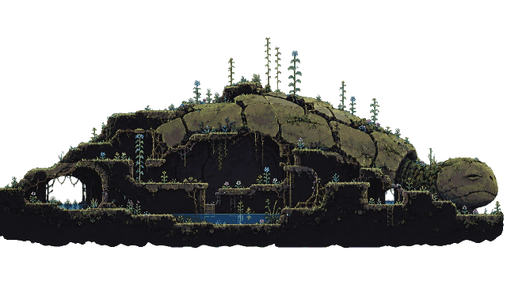

# Garden 4 — Mossy Turtle

The owner requested the giant mossy turtle as Level 4, with real routes inside
its shell, and explicitly asked for the Pixel Mill workflow. The source here is
the supplied Photo 7, processed by the actual Pixel Mill modules and retained as
editable native rectangles. Its galleries, root stairs and central pool guide
the separate playable geometry.



The two original JPEG references remain unchanged:

| Reference | Preserved source | Dimensions | Use |
| --- | --- | --- | --- |
| Photo 7, `7-Photo-7.jpg` | [Original turtle](pixel-mill/photo-7-source.jpg) | 1280×720 RGB | Input to this turtle treatment |
| Photo 8, `8-Photo-8.jpg` | [Original prop sheet](references/photo-8-source.jpg) | 1280×960 RGB | Machinery, hanging planters and small creatures; reference only |

[provenance.json](provenance.json) records both source digests, every preserved
export and module digest, and the ordinary production-manifest baseline. Photo
7 SHA-256 is `c5c8886e855fd2020b7c29c848df3799cc5b8603234e682d909ca379d5429a82`.
Photo 8 SHA-256 is `fdd1e07ebf98fc1deea2c06dcbb712a1fd7756444d18f92bc760652da3d63ec0`.

Pixel Mill source commit
`16cf029abf8e5f7ab791421b17f722d5fc5ff00c` supplied the unchanged modules in
[pixel-mill-source/dist/](pixel-mill-source/dist/). The source audit compares
the eight processing/export module hashes with the public Pixel Mill site;
their import dependencies are preserved too. The actual browser calls were:

1. Decode the immutable JPEG at 1280×720.
2. `removeBackground`: white, RMS RGB tolerance 15, `all`, at original size.
   This clears true-white background inside the open arches.
3. `processPixels`: white, tolerance 80, `edge`, 640×360, 48-color weighted
   median-cut palette, minimum area 1, connectivity 8 and bridge 0. Edge cleanup
   removes the exterior JPEG fringe. Scaling uses Pixel Mill's nearest source
   sample `floor((coordinate + .5) × sourceDimension / targetDimension)`.
4. `encodePNG`, `imageProject('import_image', autoGroup:false)` and
   `editProject` place the complete image once as a native decoration.
5. `io.exportProject` and `figma.exportFigmaKit` produce the actual editor ZIP
   and local Figma import kit.

The selected result is **640×360**, with **48 colors**, **95,097 opaque pixels**
and **135,303 transparent pixels**. Its **51,164 disjoint integer rectangles**
reconstruct every RGBA byte exactly. Alpha is binary and transparent RGB is
zero. The final RGBA SHA-256 is
`35e9e8ab3deef23d9cc3c5911460c2306ac6dc7bb52d7168232b1f6f1d6510c3`;
the review PNG SHA-256 is
`7f6c7f626fd3fa9a6700cf33b0332b98d839dcc15304581c39f5893c2b96e9e1`.
The [recipe](pixel-mill/recipe.json), [receipt](pixel-mill/report.json),
[preprocessing audit](pixel-mill/preprocessing-audit.json) and
[rectangle ledger](pixel-mill/turtle-native-rects.json) retain the actual settings
and source, prepass and final pixel hashes.

[pixel-mill-project.json](pixel-mill/pixel-mill-project.json) opens the editable
source in Pixel Mill. [pixel-mill-export.zip](pixel-mill/pixel-mill-export.zip)
contains that project, native assets, placed artwork and geometry reference.
The export's single decoration does not define the game's collision.
[pixel-mill-figma-kit.zip](pixel-mill/pixel-mill-figma-kit.zip) contains the local
Figma plugin and [level.figma.json](pixel-mill/level.figma.json) transfer. The kit
has **not been imported or synchronized with authenticated MASTER**. It claims
no new Figma source IDs or runtime PNG master.

Runtime data is generated losslessly by
[build-turtle-art.cjs](../../../scripts/build-turtle-art.cjs) into
`turtle-garden-art-data.js`. Its `sourceSha256` pins the original Photo 7 JPEG,
`recipeSha256` pins the preserved recipe bytes, and `rgbaSha256` pins the selected
normalized pixels; `palette` and `rects` copy the complete native ledger.
The native renderer caches the palette rectangles
once and draws the cache at 1:1 with integer placement and smoothing disabled.
The review PNG, original JPEGs, ZIPs and Pixel Mill source modules stay in this
documentation directory and are excluded from the production build. Existing
runtime PNGs retain their ordinary Figma production entries and byte pins;
there is no source-authority exception for this treatment.

The separate `turtle-garden-data.js` provider supplies Garden 4 when that garden
has no authored MASTER geometry. Its registration is
`{width:640, height:360, originX:180, soilY:234, imageX:0, imageY:0}`. Source
pixels use x right/y down from `(0,0)`. A source point `(u,v)` maps to
`(layout.origin + u - 180, layout.authoredSoilY + v - 234)`; the entry point
`(180,234)` therefore meets the stage origin and authored soil. The dry planting
court spans source x 166–270 at y 234; the west gallery is at y 166, crown at
y 110, and lower room at y 285.

Actual ledges, solids, ladders, planting courts and entrances govern movement.
Scenery pixels do not create support, and the pictured central pool does not
create a physical pond zone. Physical exit-plant ascent and the ordinary co-op
handoff remain part of the campaign.

The actual processing script is preserved as
[reproduce.cjs](pixel-mill/reproduce.cjs). With Playwright and Chromium available,
run it into a fresh review directory from the repository root:

```sh
PIXEL_MILL_SOURCE_ROOT="$PWD/docs/design/turtle-level-04/pixel-mill-source" \
PIXEL_MILL_SOURCE_COMMIT=16cf029abf8e5f7ab791421b17f722d5fc5ff00c \
PIXEL_MILL_INPUT="$PWD/docs/design/turtle-level-04/pixel-mill/photo-7-source.jpg" \
PIXEL_MILL_OUT=/tmp/max-turtle-source-replay-new \
PIXEL_MILL_PALETTE=48 PIXEL_MILL_TOLERANCE=80 PIXEL_MILL_MODE=edge \
PIXEL_MILL_REVIEW_BACKGROUND='#080e17' PIXEL_MILL_PRECLEAR_TOLERANCE=15 \
node docs/design/turtle-level-04/pixel-mill/reproduce.cjs
```

[source-replay-audit.json](source-replay-audit.json) records a completed replay
using the preserved module files and original JPEG. The native PNG, complete
RGBA buffer and rectangle ledger were byte-identical to the selected export;
the browser reported no page errors, blocked requests or failed requests.

Regenerate the runtime data from the preserved source and run the normal gate:

```sh
node scripts/build-turtle-art.cjs
npm test
npm run build
```

`tests/turtle-pixel-source.test.cjs` independently checks source identity, exact
recipe/module versions, normalized RGBA, nonoverlapping rectangle coverage,
palette and alpha, actual artwork inside both export packages, runtime data
equivalence and generator reproducibility. The existing Figma asset suite keeps
the production PNG audit. Geometry, camera and ordinary-input traversal have
their own checks; source integrity alone does not establish playability.
Release claims still require the full test/build gate, green exact-SHA CI and
verified production deployment.
