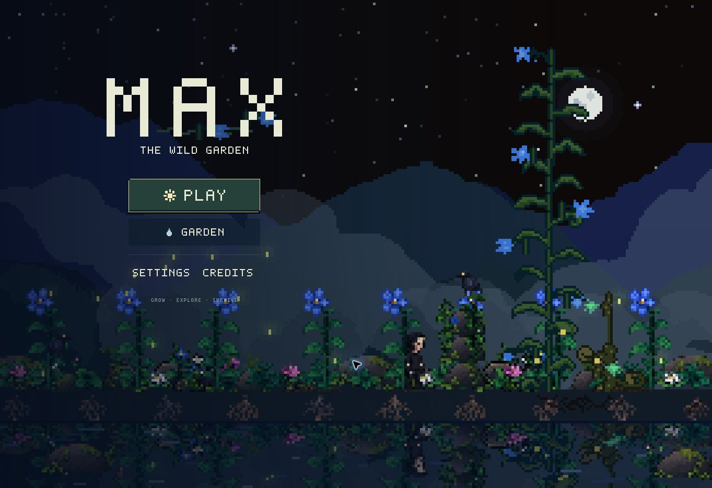
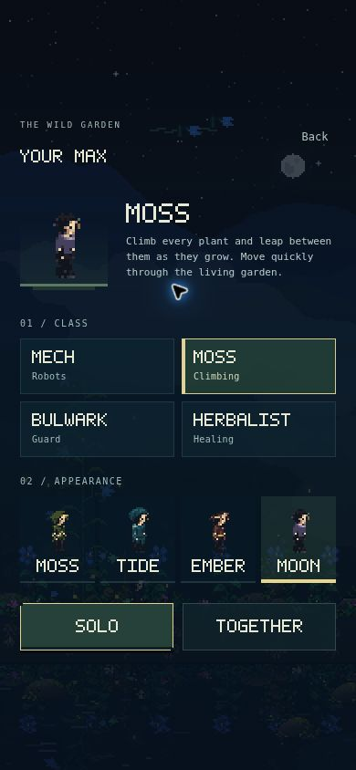
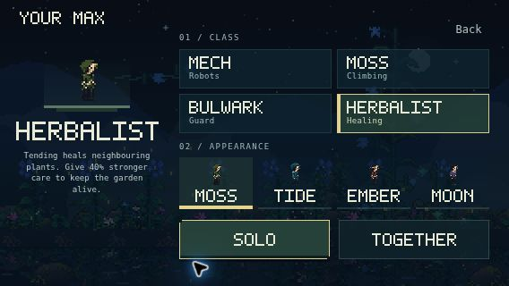

# Native menu polish — production verification

Production: https://max.iverfinne.no/

- Menu PR: https://github.com/lukketsvane/max.iverfinne.no/pull/24
- Deployed commit: `e7b9d1351f6b9da9efa4880144becb7910247a2f`
- Deployment: `dpl_95KMiUpet6KqnAioquYdbcv314Mx`
- Vercel state: READY, production target, custom domain attached, no alias error.

The earlier preview and first production attempt reached Vercel's daily deployment
limit. The final production build was accepted and verified on the custom domain.
No billing or hosting configuration changed, and no delayed retry was created.

## What changed

Home now gives the native MAX wordmark and Play action clear priority, with
Garden below and quieter Settings/Credits links. The native night garden stays
visible around the controls. Character selection has a larger selected costume,
class description and ability captions, with independent appearance swatches.
Bitmap lettering uses integer scales, and pale labels sit on a dark primary
button surface. Compact landscape uses complete native sprite frames at 1×.

## Validation

- All 278 automated tests passed; production build and whitespace checks passed.
- Menu, account restoration, independent class/skin selection, co-op and results
  behavior remain covered. A new regression checks Escape/Back focus restoration
  without pausing or restarting the active run.
- The real native menu renderer preserved all 24 checked player/run/camera/timer
  fields at 130×282, 282×130 and 320×180 canvas sizes.
- Live browser: desktop home and character selection, 390×844 portrait,
  320×568 small portrait, 844×390 landscape and 568×320 compact landscape.
- 390×844, 844×390 and 568×320 show the full chooser without scrolling. The
  320×568 chooser scrolls vertically; no horizontal overflow or inaccessible
  control was found. Its bitmap labels all measured exactly 2×.
- The compact landscape controls measure at least 44px tall. Costume frames
  measure 32×32 with a 256×256 atlas; the selected hero remains 64×64 at 2×.
- Browser navigation verified independent Moss/Moon selection, Solo start,
  Settings/escape focus restoration, Exit to main menu and Together → Sign in.
  No test accounts or public leaderboard records were created.
- No application-origin console errors were observed during these checks.
- Independent visual review found no material contrast, text clipping, sprite
  clipping or composition issue in the final screenshots.

The phone and compact landscape images capture the actual production renderer
inside the isolated review frame; they are viewport checks, not physical-device
screenshots.

## Screenshots

