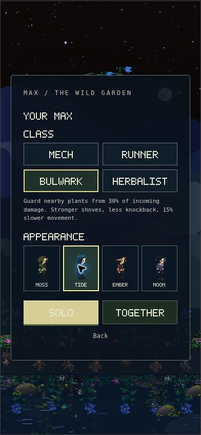
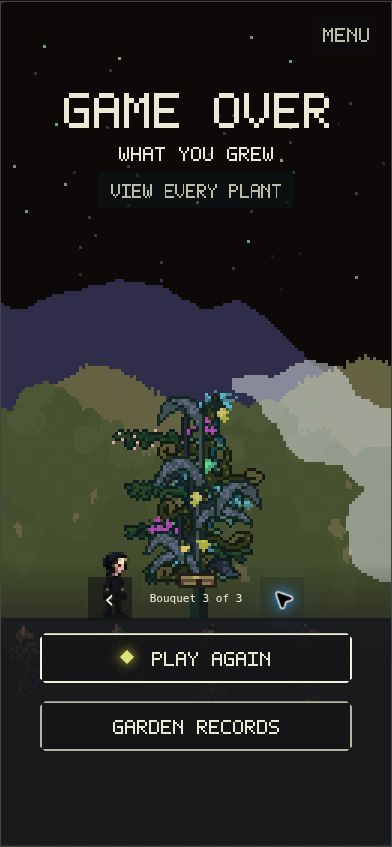

# Completed developer and graphics handoffs

Verified on 21 September 2026 at <https://max.iverfinne.no/>.

The implementation was merged in [PR #19](https://github.com/lukketsvane/max.iverfinne.no/pull/19),
production commit `054382815cdd9ae69c1347a1b74b7d5daa0d926f`. The review-storage
isolation follow-up is `9c3e5abb53562211078fe9cd68e696f44c914936`.

## Delivered behavior

- Mech, Runner, Bulwark and Herbalist have distinct starting abilities. Moss,
  Tide, Ember and Moon are independent cosmetic selections. All boon paths
  remain available to every class. Mech uses the selected watering rover.
- Supplied native skins, four specialist enemies and all three Hollow Crown
  phases render in the game with original animation timing and registration.
- Every completed garden retains its complete plant records. Local archives,
  bouquet pagination and individual-plant inspection preserve IDs, kinds,
  seeds, growth, stalk state and additional renderer data across retry/reload.
- Online publication is an explicit action owned by the account captured when
  the run starts. Public leaderboard entries contain complete bouquets and
  actual account names. There are no synthetic public leaderboard entries.
- Co-op launch confirms each member's selected class and appearance. Large
  snapshots are fragmented, paced and assembled completely before application.
  Travel clears old stage inputs and obsolete seed pickups.
- Remembered-account restoration finishes before Solo can start. Results can
  return to the main menu even when the run ended while live Settings was open.
- The visual-review iframe installs memory-only storage before external scripts
  load. It cannot read or modify normal saved gardens or appearance preferences.

## Automated checks

| Check | Result |
| --- | --- |
| `npm test` | **181 passed; zero failures/skips** |
| `npm run build` | Production static bundle built with accounts configured |
| `python3 scripts/verify-native-art.py` | **896 cells, 152 clips**; binary transparency, palettes, bounds, anchors and original event markers pass |
| Database tests | PGlite tests execute actual migration SQL and verify account ownership, direct-write denial, replay immutability and full renderer-data retention |
| Large co-op archive | Complete 20,000-plant round trip; reordered/duplicate/missing fragments, reconnects, pacing, cancellation and atomic acknowledgements covered |
| Review isolation | Actual fixture HTML, external run-record helper and bundled guest menu never obtain the normal storage object |

The final-source progression fixture completed **60 raids, 19 actual climb/warp
transitions and one final boss**, ending at garden 20 with all 40 planted records
retained. Its wide-exploration stress also transmitted every current seed
through all 20 gardens. Instant enemy kills and maintained hydration make this
a reachability/data-integrity check, **not a human difficulty-balance test**.

## Deployed browser checks

The public production deployment was checked in Chrome. The Vercel preview
build passed, but its authentication prevented browser inspection, so the
following checks used the public site after deployment:

- Selected Runner independently of Moon, started Solo, and observed Moon's
  native player art without a starting companion.
- Opened live Settings and used Exit to main menu successfully.
- Opened Garden → View runs, inspected the local completed-run listing, and
  read the live leaderboard's correct empty state.
- Inspected the 390×844 portrait class picker and independent Bulwark/Tide
  selection. All controls fit within the phone layout.
- Reloaded the isolated review menu and verified fresh Mech/Moss defaults.
- Visually inspected native skins, the four enemy roles, and all three Crown
  phases through the actual game renderer.
- Traversed all three pages of the 53-plant fixture. The final page's individual
  view exposed plants 49–53 with their attained growth values.
- Inspected the result layout in portrait and 1000×650 landscape.
- Observed no application-origin console errors in these checks. Browser
  extension metadata errors were excluded.

The bouquet screenshot is explicitly a visual-review fixture. It was not
published to the leaderboard and does not represent a player's real score.

## Hosted database

Applied `20260921204258_bouquet_leaderboard.sql` to project
`zuezxsuqkvrzypjhbbqq`. Read-only hosted checks confirmed the public table
exists, anonymous clients can read published entries, and authenticated clients
have no direct INSERT or UPDATE privileges. Public leaderboard reads also
succeeded through the deployed UI.

## Remaining manual coverage

A fresh four-account live co-op and explicit public-bouquet submission test was
not run in this pass. Automated tests exercise the actual session/transport
modules and database SQL, but do not establish four independent live browser
sessions. Physical iPhone thumb feel and device-specific audio behavior also
remain manual checks. The supplied two-track soundtrack is retained and its
lifecycle tests pass.
